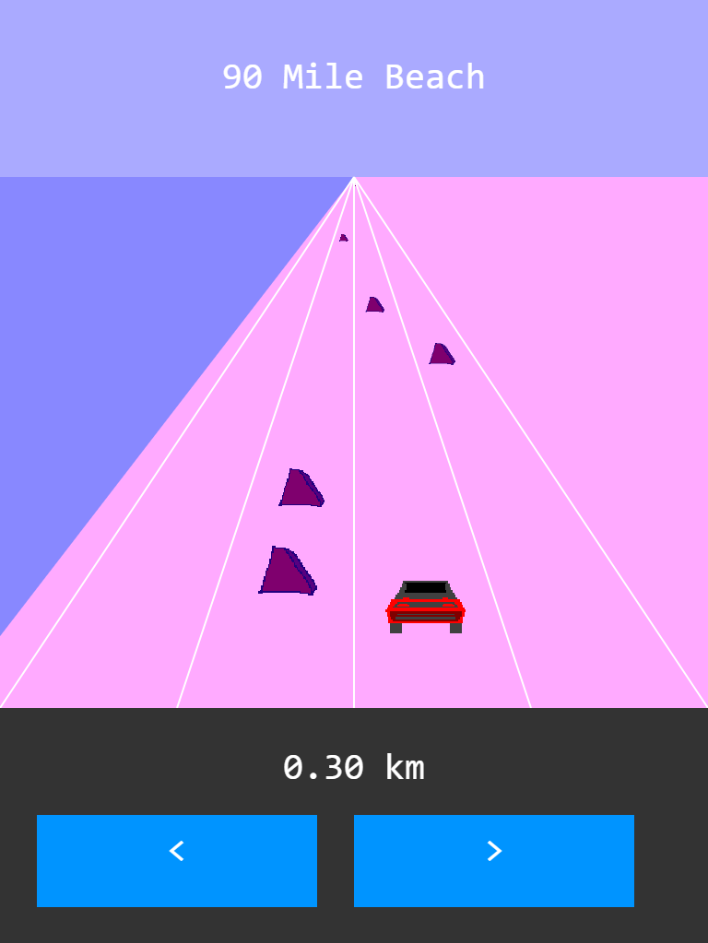

The sixth game from my one-game-a-day project.

Switch lanes to avoid obstacles.

Play [90 Mile Beach](./play/) or scroll down to learn more.

The code and game mechanics are very simple. Not much to talk about there.

I found it hard to do the fake 3D effect where the objects get larger as they get closer to you. I never got it looking correct, but I did get it to a point where it felt kind of soothing and dreamlike and I left it there.

The pastel colors are meant to evoke nostaliga. The way the car switches lanes makes me think of those handheld LCD-display games from the 80s, and the texture of the car itself is meant to feel like it's from an early 2.5D racing game like Out Run (1986).

The real 90 Mile Beach is a beach in New Zealand that is legally considered to be a public highway. It is strongly recommended that you do not try to drive on it, because it is a beach and your car will sink into the sand. When I was young my parents took me and my siblings on a journey all around New Zealand and we drove along the beach in an four-wheel-drive SUV that could handle the terrain. I have a vague memory of Dad encouraging someone - maybe me, maybe my sister? - to try driving the car for a while.

My tweets from the release:

> Because I was a day behind, here's another little #100DaysNZ game for today: [https://mgatland.com/games/90-mile-beach/play/](./play/) 😅

In reply Ben Mitchell encouraging me to keep the games coming:
> thanks! I'm having fun, but it's hard – I hope I'll get more efficient as I go.

See the [discussion on twitter](https://twitter.com/mgatland/status/868394090055872512).
