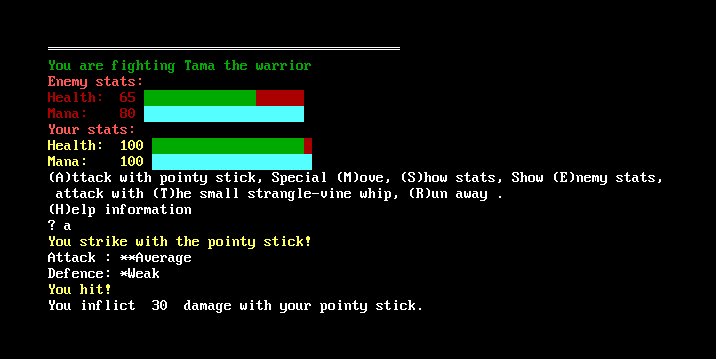
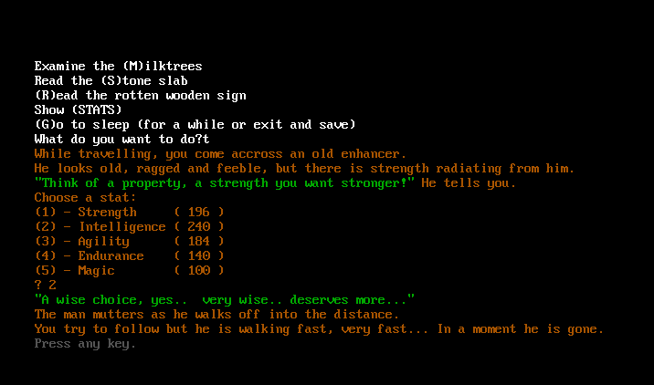
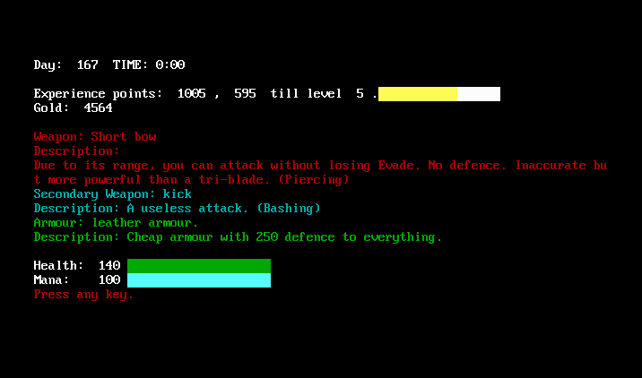
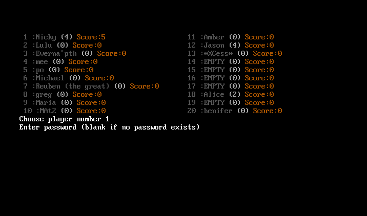
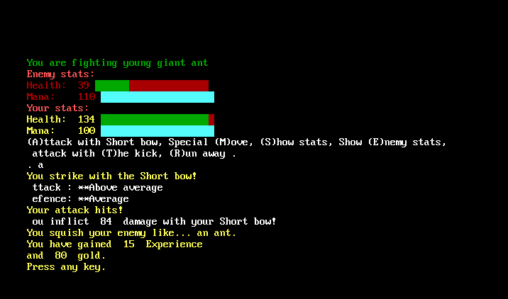
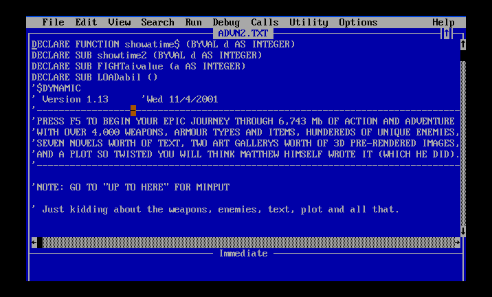
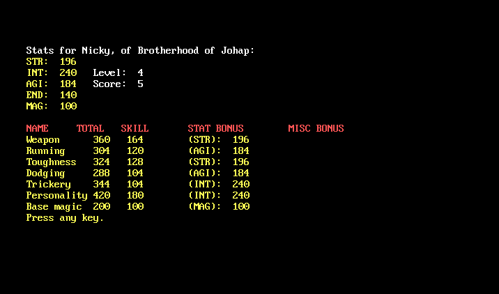

Here is a game I made in high school (which feels like a long time ago).

This is a persistent-world multiplayer text RPG inspired by <a href="http://en.wikipedia.org/wiki/Legend_of_the_Red_Dragon">L.O.R.D.</a> (Legend of the Red Dragon).

The game has no network support, so it's multiplayer hot-seat. Each player must sit at the computer and take their turn. Once every player has had their turn, someone can advance the game to the next day and everyone can take another turn.

The game was written in QBasic. This release is compiled in FreeBasic so it works on modern operating systems.

<a onclick="_gaq.push(['_trackEvent','Download','Game',this.href]);" href="adv-2010-06-29.zip">Adventure</a> (150 KB, Windows only*, source included.)

The game should also run on Linux and OS X but you will have to compile it yourself using FreeBasic.

