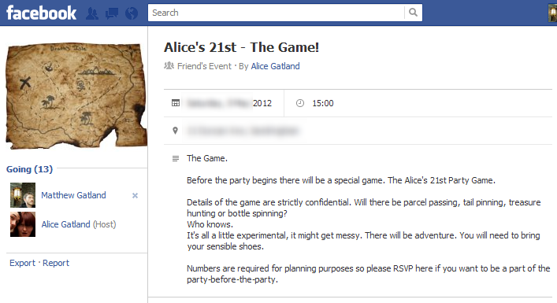
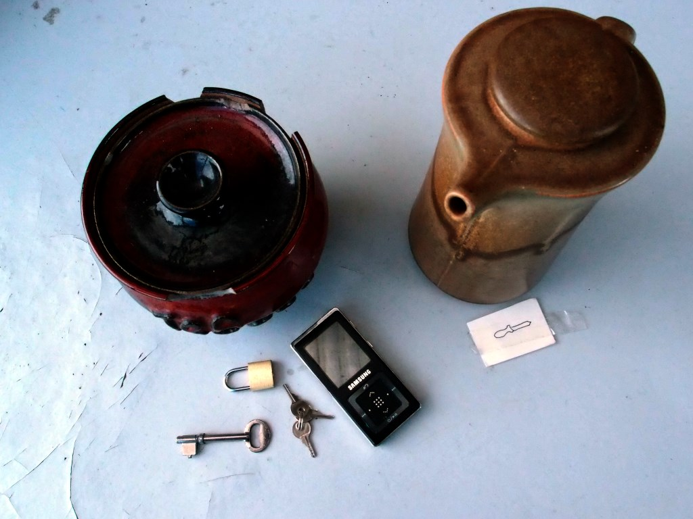
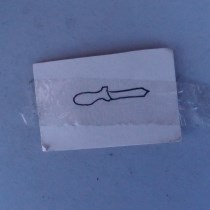

I helped my sister plan a game for her 21st birthday party.

We wanted to take the players on an adventure that started small, then became larger (and then larger again!). We had to do this without a lot of time or money to organise elaborate events. Here's what we ended up with:

### Act 1 ###

The game started as a game of <a href="http://en.wikipedia.org/wiki/Pass_the_parcel">pass the parcel</a>. Each layer of the parcel had instructions for the player who unwrapped that layer.

The instructions started out simply: "Eat this." "Drink this."

They became more elaborate: "Go into the kitchen; in the top cupboard are some chips. Bring them out to share with the group."

Some of the players received items that they were asked to wear "for the rest of the game." They didn't know it yet, but these items would be their 'super powers' used to solve puzzles in Act II.

One player secretly received an envelope to be opened only when "all hope is lost."

In the very center of the parcel was a mobile phone. It started ringing just before it was unwrapped. Once unwrapped, a player answered the phone, and was told to go to the backyard.

### Act 2 ###

Act 2 was a <a href="http://en.wikipedia.org/wiki/Treasure_hunt_(game)">treasure hunt</a> set in the park and streets near my sister's house.

Each clue was kept inside a ceramic teapot (or similar item). Every clue involved a challenge. Here's a list of everything I remember, in detail:

* The first teapot was hanging high in a tree. Spotting it was a challenge in itself. The more athletic members of the group worked together to climb the tree and get it down. Inside the teapot were letters on large coloured cards - an anagram. Solving the anagram gave the location of the next clue.
* The second teapot near a playground. This contained an MP3 player. One of the players received headphones during Act I; they had to connect these to the MP3 player to listen to a recording on it. The recording was from the point of view of a soft toy which had been kidnapped from their current location, describing the path that it was taken along.
* The third teapot was locked in a steel 'cage' at the edge of the park. A key from Act I unlocked it. Inside the teapot was a soft-toy dog and a map of the surrounding area. The map indicated the location of the next clue.
* The fourth clue was a string tied to a small bridge in the park. A ribbon drew attention to the start of the string. The players had to follow the string through the muddy river to find a teapot at the end. Inside, a note told the players that they had won and should return to the house - their prize was in the mailbox.

### Act 3 ###

While returning to the house, Alice disappeared from the group.

In the mail box were three sudoku puzzles. Once solved, these revealed a phone number.

Calling this number revealed that Alice was kidnapped and that "all hope is lost".

One player received a sealed envelope at the beginning of the game, to be opened when "all hope is lost".

This led them on a miniature high-speed treasure hunt around the house. There were four clues, and each clue started with a highlighted word:

* in the sealed envelope: <b>LOOK in the freezer</b>
* inside a block of ice inside the freezer: <b>IN a box under Alice's bed.</b>
* under Alice's bed: <b>THE space above your head</b>
* taped to the ceiling, directly above the bed: <b>DOG :(</b> (with a picture of a nearby craft knife on the outside of the note.)

As the players immediately guessed, the final clue was hidden <i>inside</i> the stuffed dog that they collected in Act II.

They sliced the dog open. Inside it's stuffed belly were grid coordinates.

Using these coordinates with the map from earlier revealed Alice's location - the nearby pub.

That was the end of the game. At the pub, Alice was waiting with drinks and snacks for everyone.

### Discussion ###

This was our first treasure hunt for a long time and we made plenty of mistakes.

The biggest was underestimating how long some of the activities would take. The first clue, in the tree, look a very long time (but was fun.) The MP3 recording was long and boring and not enjoyed by the person listening to it, or engaging for the others who could not listen.

Asking the players to solve three sudoku puzzles just after "winning" and returning to the house was not appropriate – they lost interest and it turned into a disorganised break. By that stage in the game, we needed the pace to be super-fast; it was meant to be one final burst of excitement before relaxing at the pub.

At one point we made the players backtrack. This was frustrating for some of them, as they didn't like having to walk the extra distance and they had noticed the clue earlier (out of order) but were told that they were not supposed to find it yet.

The idea of giving each player an item in pass-the-parcel that would be used later in the game was intended to make players feel special. In practice, it didn't work. For example, the players who reached the locked cage first immediately knew that the key was needed, and the player with the key didn't feel any special sense of achievement for carrying it. Instead, they felt rushed because the leading player wanted them to hurry up.

The 'only open when all hope was lost' envelope did work, but it would have been nice if every player had this kind of secret knowledge that they could have pulled out at some point in the game.

We did succeed in our goal of making a game that started small and then grew larger. We also had some great moments throughout the game: climbing the tree to retrieve the first clue, following the string through the muddy river, and slicing open the dog were all powerful moments that they players will remember.

This page was written on 2012-06-08.
