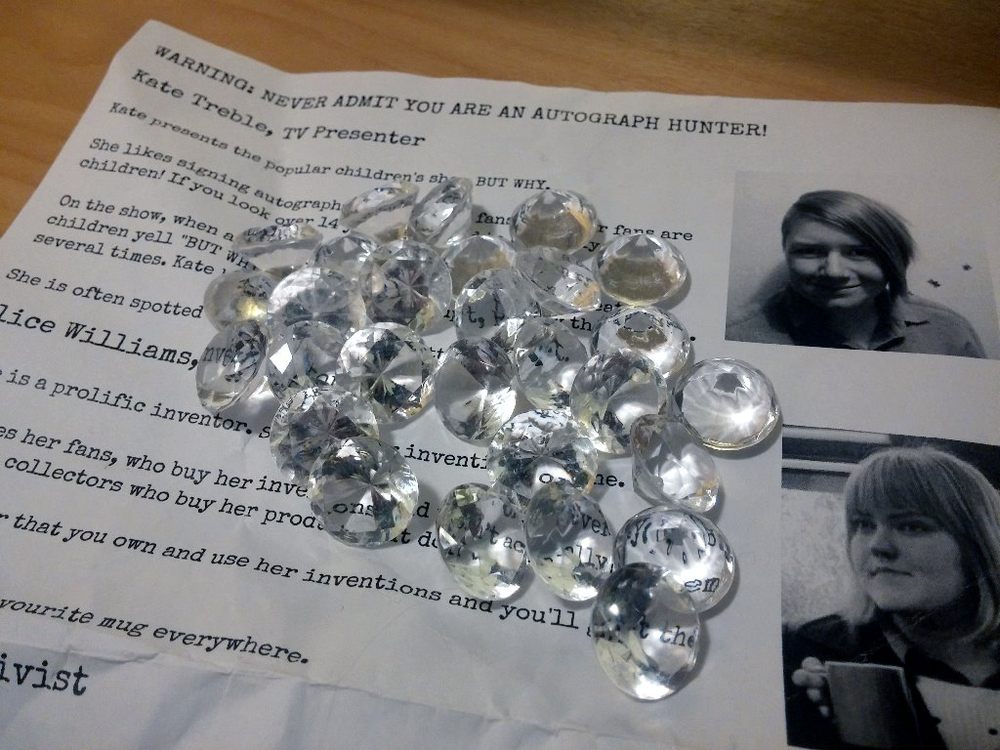

A non-digital game created for the [Wild Streets](http://wildstreets.weebly.com) festival in February 2015.

> Famous celebrities are hiding around the park. Their autographs are worth a lot of money – but they won't sign for just anyone! Use your wits, charm and outrageous lies to get the autographs.

### Resources ###

Note: You will need to create your own version of the Celeb Guide with photos of your actual actors. The copy here is just for reference.

* [Celeb Guide](autograph-hunter-celeb-guide.pdf) – print one copy per expected player.
* [Actors' notes](autograph-hunter-actors-notes.pdf) – print one copy, to read through with the actors.
* 4 pens.
* Props: book, butterfly net, mug, shovel.
* Prizes: I used small plastic diamonds.
* Five staff in total: four 'celebs' plus the host.
* A large play area like a park or convention.

### Setup ###

The game runs for a fixed period of time (Fom 30 minutes to 3 hours, or as long as your cast can stand!) Players can start and finish at any time during this period. They don't need to be there at the start.

Four actors play the famous celebrities. They should each read the Celeb Guide, and then the Actor's Notes for their character.

Each is given a pen and their character's prop (book, mug, butterfly net or shovel.) They position themselves around the play area. They may move around during the game.

The host positions themself at the information desk or starting area for the game. The host has:

* Enough copies of the Celeb Guide for every potential player.
* A bag of rewards for the winners. I used plastic gems.

### The Celebs ###

Players will approach the celebrity and try to get their autograph.

Each celebrity has different rules about who they'll give the autograph to. Try to help the player figure out what you want, without being too obvious.

Read the [actors' notes](autograph-hunter-actors-notes.pdf) for more detail on the specific characters.

### The Host's Role ###

When players approach, the host says:

> Hi! Around this park are four super-famous celebrities. You may not have heard of them, but their autographs are worth a lot of cash! The problem is, they know I'm an Autograph Hunter and they won't sign for me. They won't even talk to me! That's where you come in.

> They don't know who you are, so you can trick them! Here is some info about each celebrity, that will help you work out how. You may need to lie - you may need to pretend to be someone else, to get the signuature.

> If you can get all four autographs, I'll give you a fantastic prize!

The players can collect the signatures on the back of their Celeb Guide. (If they ask about pens, explain that "Don't worry. Celebrities always carry their own pens.")

When players return with all the signatures:

> Thank you so much! I'll sell these on the black market. Here's your reward: A fake diamond. It's not really worth anything, but I figure, you're so good at tricking people, you'll probably be able to get a good price for it. Thanks for your help!

### Licence ###

You may run Autograph Hunter at your own events. You do not need to ask my permission or pay me (although you are welcome to!)