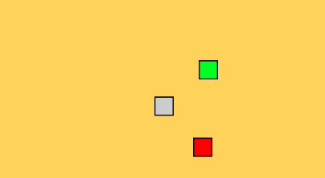
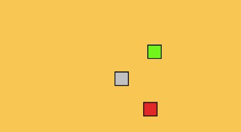

The sixteenth game from my one-game-a-day project.

Play [Avoiding](./play/) or scroll down to learn more.

Collect the green squares and avoid the red squares! But beware: every collected green square turns into a red square.

This is a remake or reference to the final project in my COMPSCI101 course at university. The project was designed by lecturer [Paul Denny](https://www.cs.auckland.ac.nz/~paul/) who taught the course and used a different game as the final project each semester. Cool stuff.

My tweet from the release:

> after quite a few days off, today's #onegameday is called 'avoiding' [https://mgatland.com/games/avoiding/play/](./play/) 
> 

See the full [twitter thread](https://twitter.com/mgatland/status/874232996114518017).
