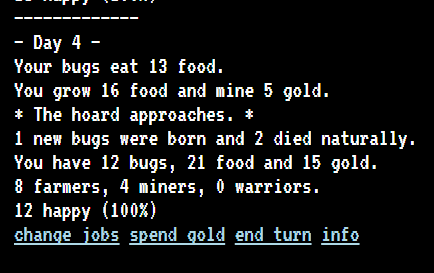
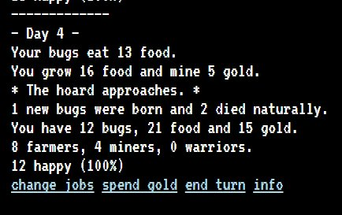

The twentieth game from my one-game-a-day project.

Play [Bugs](./play/) or scroll down to learn more.

When I first started learning to code, I made a text-mode sim game called Bugs. It was zany and charming. You could turn your bugs into farmers, miners, or warriors, and the warriors never did anything. You could build many bug farm upgrades including a nuclear power plant which had a tiny chance of melting down each turn. The game was hot-seat multiplayer and I sometimes played with my siblings or friends.

The original code for Bugs was lost a long time ago. I tried many times to make Bugs 2 (with seasons! with graphics! with warriors that actually did something!) The remakes never felt the same.

This is another in a long line of attempts to recapture that magic. It isn't there, but I did manage to give a purpose to the warriors! And there is a tiny bit of numbers-go-up satisfaction from playing this.

This game had 3 hours and 18 minutes of development time.

My tweet from the release:

> These text games have been surprisingly slow to build. They always came together so quickly in QBasic! #onegameaday  
> [https://mgatland.com/games/bugs/play/](./play/)  
> 

See the full [twitter thread](https://twitter.com/mgatland/status/876686125649149956).
