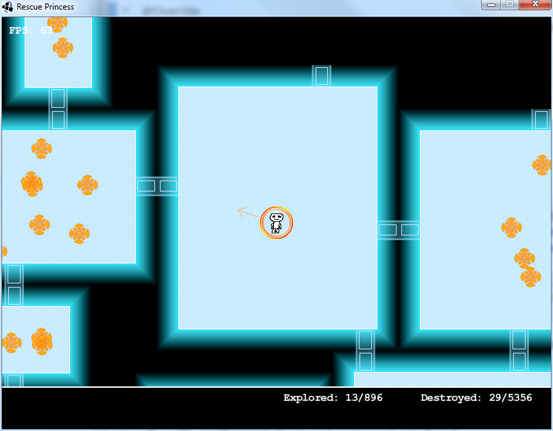

Download <a href="circles-ld21-full.zip">Cerulean</a> - 5 MB

Read more about the game on its [Ludum Dare](http://ludumdare.com/compo/ludum-dare-21/comment-page-2/?action=preview&uid=1113) page.

The game works on Windows, Mac or Linux, but you must have Java installed.

### Description

You're trapped in a hostile world, with only one way out: find the eight cerulean circles.

### Instructions

Download the zip file and extract it. Run ld21_localcoder.exe and read the instructions on-screen. (For Mac or Linux, run the .jar file instead.)

### Tools used

* Java + Slick (+ LWJGL) + Eclipse
* Paint.NET

Cerulean is [inspired by\a clone of] Meritous by Lancer-X/ASCEAI.
