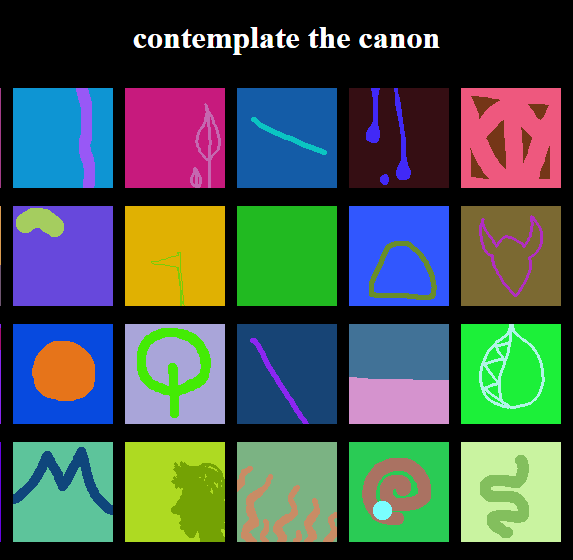
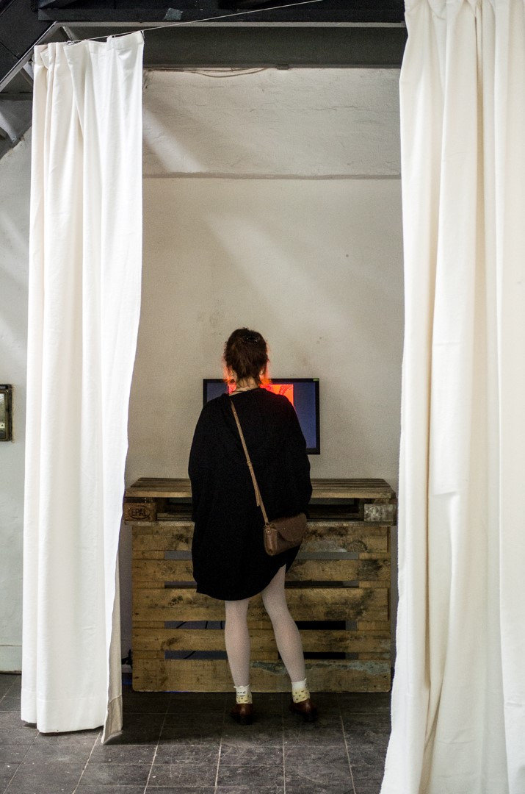

By Sergio Cornaga, Matthew Gatland and Elliot Hayward. Based on flickgame by Stephen Lavelle.

[Perform the ritual](http://faithgame.herokuapp.com) or [contemplate the canon](http://faithgame.herokuapp.com/gallery.html)

Faithgame is a game-making ritual. By following strict constraints, our games become closer to perfection -- as do we.

We started by taking the source code from the brilliant but unorthodox game making tool [flickgame](http://www.flickgame.org/). We purified the tool, for example by correcting its irregular aspect ratio to a perfect square.

We soon divined that a perfect game has 10 pages, is created in silence, and is published in secret. We continued to modify the tool to help users perform the game-making ritual canonically.

Faithgame was exhibited at [tinypalace](http://tinypalace.de/), an alternative games festival in Kassel, Germany.

More resources:

* [Faithgame](http://globalgamejam.org/2016/games/faithgame) on the Global Game Jam website
* [Faithgame source code](https://github.com/mgatland/faithgame/) (with our [semi-performative commit logs](https://github.com/mgatland/faithgame/commits/master))

