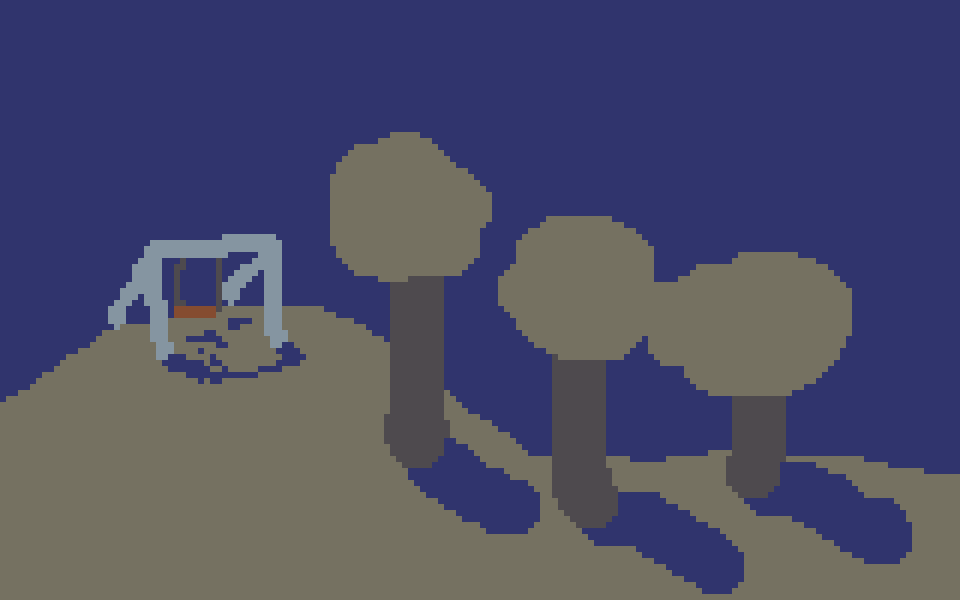

flickgame is a quick-and-easy game creation tool by Increpare. It's great when you want to make a game _fast_.

[threadbare](threadbare/) is a flickgame I made with Kate Pike, Alice Gatland and Sergio Cornaga. We made it in one night, each taking 20 minutes to add 4 pages to the game.

[Good Shepherd](good-shepherd/) is a flickgame I made on my own.

Protip: In flickgames, you progress by clicking on different colours. Your pointer will change from an arrow to a finger when it's over a colour that you can click on.