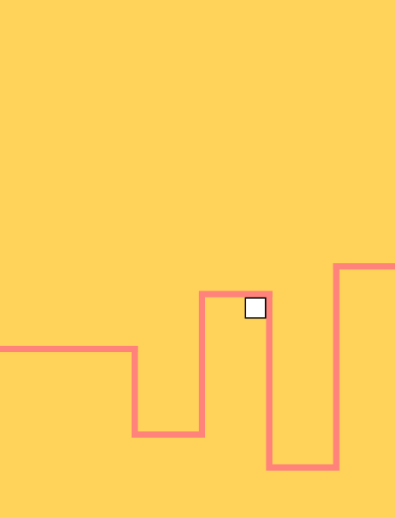

The fifteenth game from my one-game-a-day project.

<!-- it technically supports touchscreens/phone but I haven't tagged it because it's almost unplayable. Touch delay time perhaps. -->

Play [Follower](./play/) or scroll down to learn more.

Simple line follower game, heavily borrowing ideas from a game I saw on Scratch. (I unfortunately can no longer find original Scratch project the credit them.)

It's quite fun to play.

At this point in the game-a-day project I was starting to fall behind and miss days. I tried to set up some reusable javascript so I could make the next few games more quickly and easily. 

My tweet from the release:

> hi i am matthew and i make a game every day using javascript. Here is today's game! [https://mgatland.com/games/follower/play/](./play/) #100DaysNZ

See the full [twitter thread](https://twitter.com/mgatland/status/872800213840216064).
