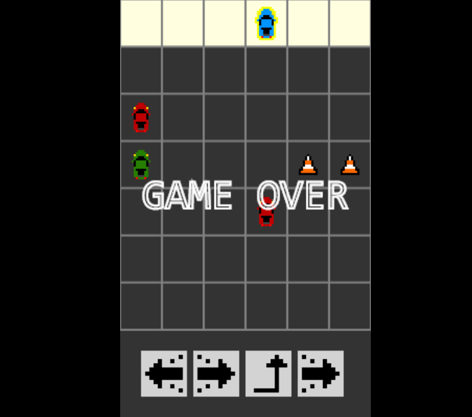

The fourth game from my one-game-a-day project.

Play [Glitchrace](./play/) or scroll down to learn more.

Inspired by Michael Brough's [Glitch Tank](http://www.smestorp.com/presskit/sheet.php?p=glitch_tank).

I copied Glitch Tank's grid and deck of random actions you can choose from. Sadly, I wasn't able to get the strategic depth of sheer chaos of the original game. In my Glitchrace, it's always clear which card is the best to play and it's simply a matter of playing the best cards when they come up in your random draw. I wasn't able to create a situation where you had to really think about which card to play.

Even though the game is bad, I was enjoying making one-day-games and pushing myself to try out genres I wasn't used to. I would love to spend more time trying to learn how to make a game with hard strategic choices.

My tweets from the release:

> My 4th one-day game for #100DaysNZ: [https://mgatland.com/games/glitchrace/play/](./play/)
> I was doing a week without violent games but I accidentally you can explode ppl

> Any ideas for making it more strategic and less random? Maybe a card that moves the cones...

> sneaky update today now says 'winner' if you win, + is slightly more strategic + less random?

And, later:
> um, how do turn-based games work? The player makes a choice, one option must be better, but it can't be obvious, and it can't be unknowable…

See the [discussion on twitter](https://twitter.com/mgatland/status/867587575237689348)

