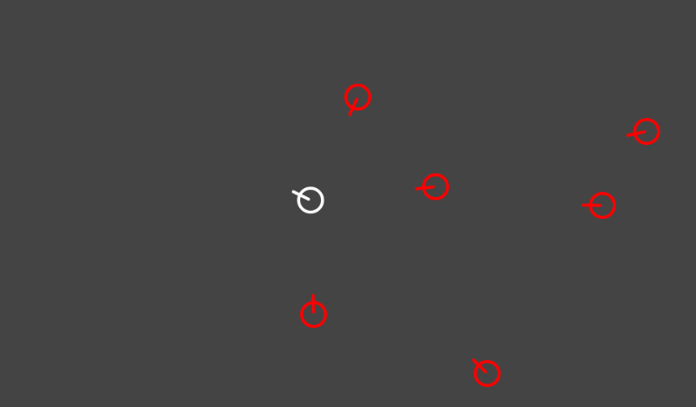
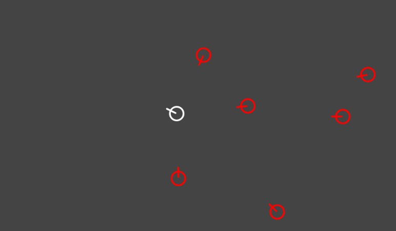

The nineteenth game from my one-game-a-day project.

Play [Gunson](./play/) or scroll down to learn more.

I loved the map in Hitman: Blood Money. It was so clean and high-tech and showed little red circles representing your targets as they walked around. I felt like they could have omitted the 3D worlds completely and set the whole game within that map.

So that's the idea behind this. Combining the beautiful clean look of Hitman's maps with the in medias res action scenes from Superhot.

It came out ok. There's the start of something exciting here. If you're good with your mouse, you can quickly spin around and fire slow-moving shots at all the enemies then watch them all collide in a satisfying way.

Playing this reminds me of [Chase](https://en.wikipedia.org/wiki/Chase_(video_game)) and its clones, although the connection was not intentional.

This game had 2 hours and 42 minutes of development time.

My tweet from the release:

> it's bed time but I made another #onegameaday, this one is about shootouts [https://mgatland.com/games/gunson/play/](./play/)
> 
> plz send me quotes from movie shootouts
> 

See the full [twitter thread](https://twitter.com/mgatland/status/876425358689452033).
