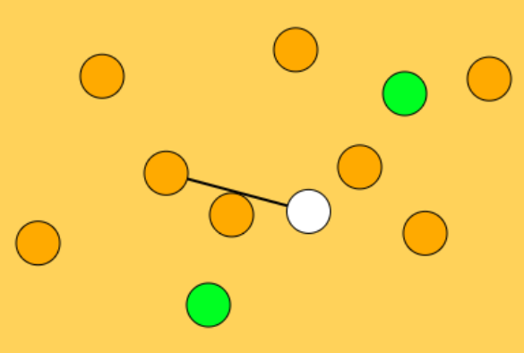

The seventeenth game from my one-game-a-day project.

Play [Hatmin](./play/) or scroll down to learn more.

Reusing a lot of code and ideas from previous one-day game [Avoiding](../avoiding/) but adding grappling-hook physics.

I think there's potential for something fun here but I didn't get it working in the time I had. So I'm not very happy with the end result, but I am happy that I made a grapppling hook game - I believe it's the first one I ever did.

My tweet from the release:

> Hatmin. #onegameaday [https://mgatland.com/games/hatmin/play/](./play/)

See the full [twitter thread](https://twitter.com/mgatland/status/874516162146586624).
