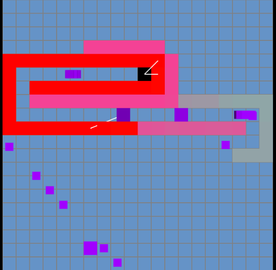
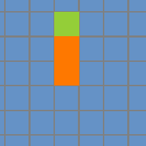

The tenth game from my one-game-a-day project.

Play [HRVST](./play/) or scroll down to learn more.

A tower defence game, and actually a remake of one of my own games. Both this and the original have a mechanic where each tower comes with some ammo and ammo transfers between adjacent towers, so you can create chains of towers to shift ammo around the map.

I think the original was better, which is expected since it had more than one day of development time! But the original game is lost so this remake is all we have for now.

My tweet from the release:

> I'm making #onegameaday! Today's is a simple tower defence: [https://mgatland.com/games/hrvst/play/](./play/) #100DaysNZ
>
> 

See the full [twitter thread](https://twitter.com/mgatland/status/869890658005274624).
