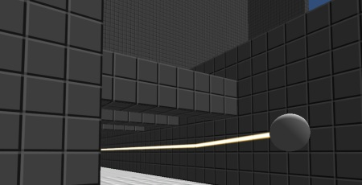
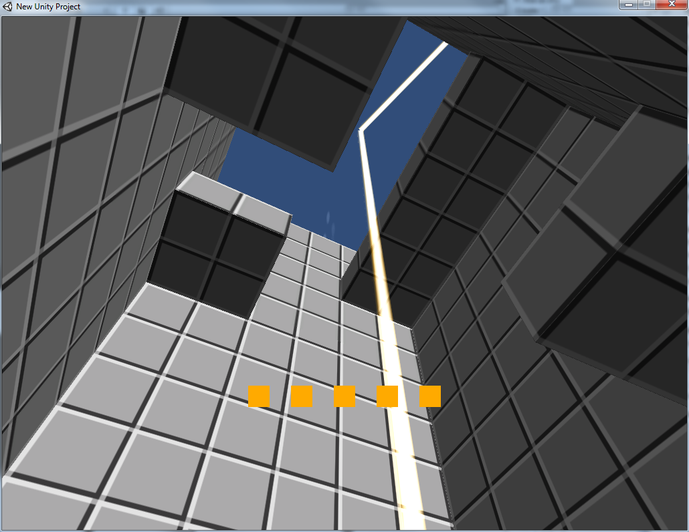
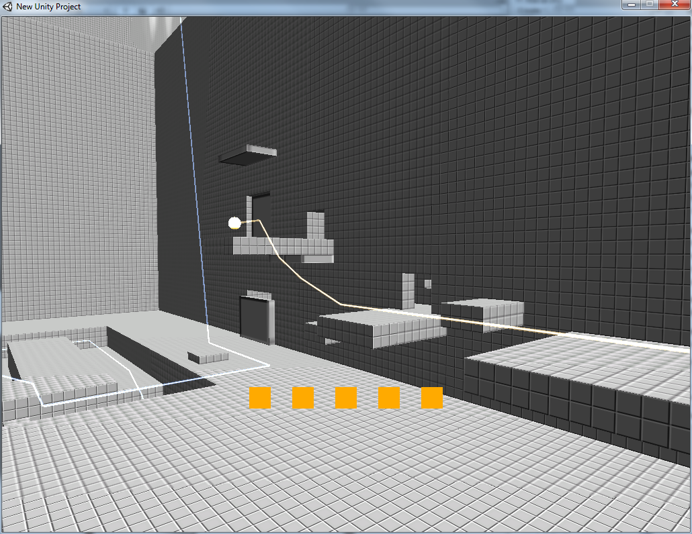

A short first-person exploration game for Ludum Dare 19.

<a href="improv-ludumdare19.zip">Download Improv for Windows - (8 MB)</a>

<a href="improv-ld19-source-small.zip">Download Improv source code - (10 MB)</a>

Controls:
 

Mouse to look, WASD to move, spacebar to jump. No clicking required. 

Known Issues: 

The ending is unreliable. If it isn't working, or is working very slowly, try leaving and coming back, and jumping. It will work eventually :)

<!-- this just duplicates the banner at the top  -->

