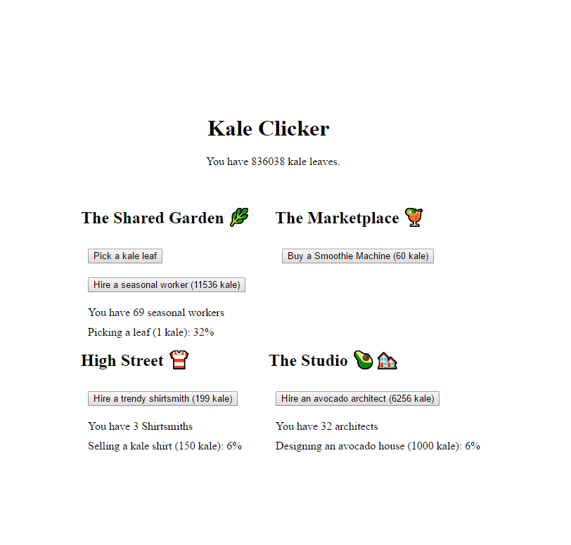

The first game from my one-game-a-day project.

Play [Kale Clicker](./play/) or scroll down to learn more.

I wanted to make something easy for my first one-day-game. I'd played several browser-based incremental games and thought the genre would be a great place to start.

Making the game was quite straightfroward. I was surprised how fun the result was, even without any of the twists or advanced features seen in the bigger incremental games. It's just fun to see the numbers go up.

Kale Clicker was inspired by other browser-based incremental games including:
* [Candy Box 2](https://candybox2.github.io/candybox/) by aniwey
* [A Dark Room](https://adarkroom.doublespeakgames.com/) by Michael Townsend and Doublespeak Games
* [Universal Paperclips](https://www.decisionproblem.com/paperclips/) by Frank Lantz

Some of my tweets at the time of release:

> For #100DaysNZ I'm making a game every day. Here comes 3 months of late nights and neglected responsibilites! [https://mgatland.com/games/kale-clicker/play](./play/)

> tbh it's hard to start game #2 when there is so much low hanging fruit to improve game #1

> It's very influenced by Dungeon Inc which @PikPokGames
 just released – take a look if you like weirdly addictive numbers going up

See the [discussion on twitter](https://twitter.com/mgatland/status/866805026907226113)