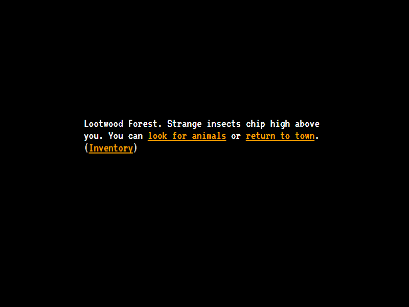
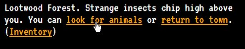

The seventh game from my one-game-a-day project.

Play [Legend of the Red Bird](./play/) or scroll down to learn more.

So this is a homage to Seth Robin's [Legend of the Red Dragon](https://en.wikipedia.org/wiki/Legend_of_the_Red_Dragon). I made a L.O.R.D-like one before: Adventure, an ambitious game I worked on for several years as a teenager.

This time I only had a few hours, but another interesting constraint is that I was trying to make all of my one-day games non-violent. L.O.R.D. has a game loop built around fighting creatures in the forest. Seth Robinson went on to create a non-violent game with a similar game loop to L.O.R.D. loop called Funeral Quest, where the player owns a funeral parlour and tries to convince grieving customers to spend more and more on funeral expenses without pushing them too hard and making them leave. I would try to do something similar here.

So the idea is that you're trying to catch birds. The bird has a scaredness level and a distance in metres. You can move closer to the bird but you risk making it more scared. You can spend food to get the bird closer without increasing its scardness.

In my case, the end result is bad. There isn't any strategy; you just move closer to the bird and use food if you you have it. This is an example of me trying something new, finding some interesting challenges but not getting as far as solving them. There's also no meta-progression or upgrades to keep the player engaged.

It would be fun to revisit this and try and make something of the bird-catching mechanic. But I can't really recommend playing this version.

My tweets from the release:

> today's game-in-a-day, in just before midnight! [https://mgatland.com/games/lorb/play/](./play/) #100daysnz
> 

See the [twitter thread](https://twitter.com/mgatland/status/868798263884828672).

