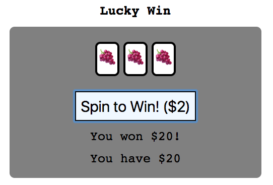

The thirteenth game from my one-game-a-day project.

Play [Lucky Win](./play/) or scroll down to learn more.

Another remake of one of my early QBasic games from when I was first learning to code. There isn't much going here and there wasn't much going on in the original version either. The only notable difference is that the original used text-mode and ASCII symbols and this new version uses emoji.

This game had 1 hour and 54 minutes of development time.

I think I was a bit embarrassed about this because I announced it and the following game together in the same tweet:

> I pretend to make #onegameaday using JavaScript! Here are my latest two 
> 
> Lucky Win: [https://mgatland.com/games/lucky-win/play/](./play/) 
> Said So: [https://mgatland.com/games/said-so/play/](../said-so/play/)

See the full [twitter thread](https://twitter.com/mgatland/status/872313516769906688).
