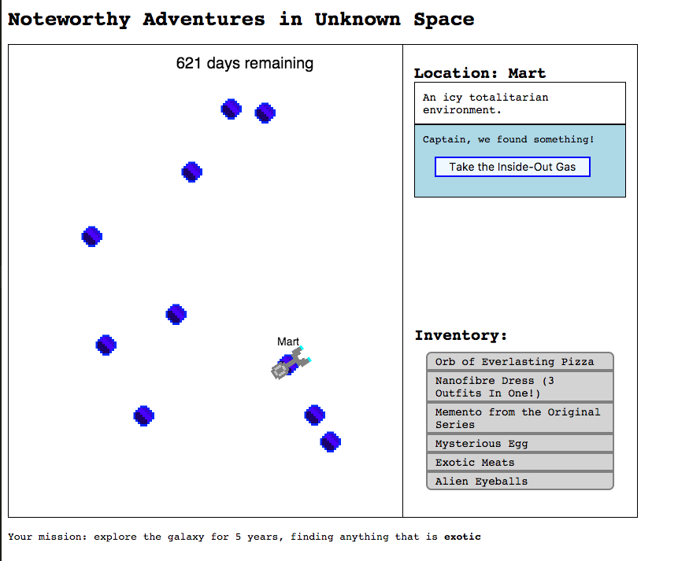

The second game from my one-game-a-day project.

Play [Noteworthy Adventures in Unknown Space](./play/) or scroll down to learn more.

This was a quick attempt to clone [Strange Adventures in Infinite Space](http://digital-eel.com/sais/) by Digital Eel. I found that game facinating but also _very_ strange. It came out in 2002 and and was right on the boundary of the wildly inconsistent and wonderful game designs of the 90s and the much more structured and organised game designs we have today.

It's hard to remember the development process any more but I suspect this game took a lot longer to make than the previous day's, with a lot of time going into the spaceship's movement.

When playing the game, there's a really annoying aspect where your spaceship can waste a lot of time trying to turn around to land on a planet that wasn't quite in the right direction. This is taken directly from the original Strange Adventures, and I really hate it but I decided to keep it to try to preserve the quirkiness of the original game. If this was more than a 1-day project I would probably do something about this: probably make the trajectories more forgiving, and maybe even let you see the flight path and cost to reach a planet before deciding if you want to go.

I think this game is not very good, but there is something to it. You can replay it a few times, gradually learning how the systems work and eventually using your knowledge to have a successful run.

My tweets from the release:
> Yesterday's #100DaysNZ game is half-baked, but it's time to move on so here you go: [https://mgatland.com/games/noteworthy-adventures/play](./play/)

> With more time I'd like to reward people more for remembering who has/wants what and arranging multi-step trades

> me: I'm going to make a game in 2 hours!
> me: *spends 1.9 hours making the movement look smooth*

See the [discussion on twitter](https://twitter.com/mgatland/status/867154785597767681)
