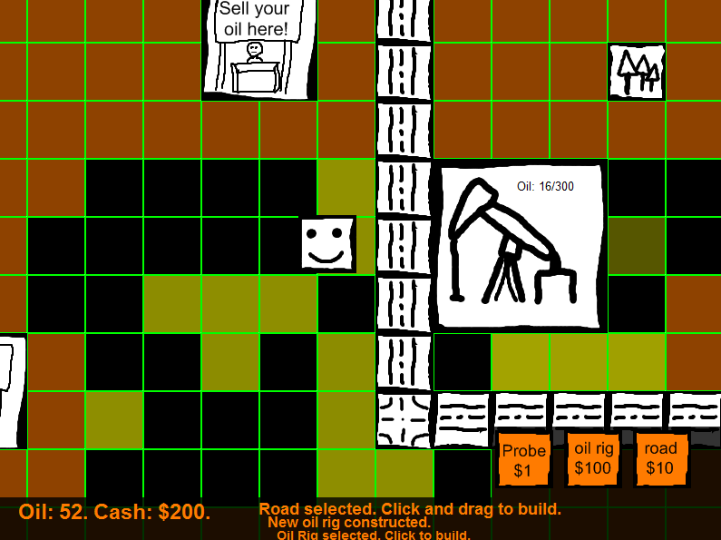

Find oil, become wealthy.

Play [Oil Exploration](play/)

Made for Ludum Dare 16.

More info at the [Ludum Dare page.](http://ludumdare.com/compo/ludum-dare-16/?action=preview&uid=1113)

Some things that might not be obvious: 

* Brighter yellow means more oil, but size matters more. A big and dull oil field is much better than a small and bright one. 
* So try to find a lot of yellowish squares all touching each other. Diagonal touching counts. 
* Oil rigs pump faster when there is more oil below them. 
* Click once on the game to make keyboard controls work. 

Made in ActionScript (Flash) using FlashDevelop. Programmer art made in paint.net.