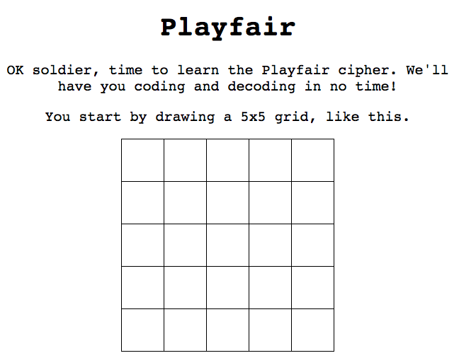

The twenty-first game from my one-game-a-day project.

Play [Playfair](./play/) or scroll down to learn more.

When I was in high school a friend gave me a letter with an encrypted message. I tried to decode it using [frequency analysis](https://en.wikipedia.org/wiki/Frequency_analysis) (using a Microsoft Excel spreadsheet to do the math). It would have worked if it was a simple substitituion cypher, but it was not. It was a Playfair cypher!

If you ever recieve one of these, this game -- more of an interactive tutorial -- will teach you how to decode it properly.

Development time: 2 hours, 11 minutes.

My tweet from the release:

> This one isn't quite a game but it is educational! [https://mgatland.com/games/playfair/play/](./play/) #onegameaday  
> 

See the full [twitter thread](https://twitter.com/mgatland/status/878817082434912256).
