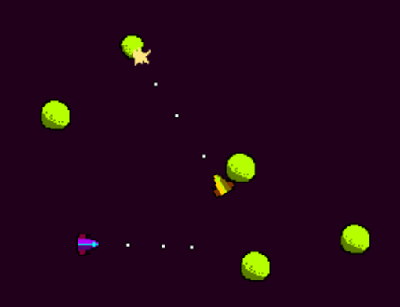

The eighth game from my one-game-a-day project.

Play [Rockstormers 1](./play/) or scroll down to learn more.

This is heavily influenced by [Comet Busters](https://archive.org/details/CometBusters14Image), an early Windows game that I had a whole lot of fun with. When I say 'Windows game' I'm talking about a specific genre: games that ran in a window as if they were a Windows app, as opposed to full-screen games like Doom that ran _in_ Windows but didn't feel like they were _of_ Windows if you get what I mean. Other 'Windows games' that come to mind are the built-in games Minesweeper, Solitaire and Space Cadet Pinbball, but also Star Wars: Yoda Stories.

Anyway... I digress. Comet Busters itself was an Asteroids clone, but it added some interesting twists. It supported up to four players in multiplayer, players had a Smash Brothers-style shield and could be given a special ability. You could configure whether asteroids could be destroyed or not and whether the player's shots were lethal to each other or not.

My game, Rockstormers, was based on one of my favorite configurations of Comet Busters. Your shots deal knockback but no damage, so you can kill the other players only by knocking them into asteroids.

I was still pushing myself to do non-violent games so at the end of development I added a non-combat goal: you are now racing to pick up a capsule of treasure. Turning this into a racing game was a good move: moving your ship has always been the most exciting part of Asteroid clones but players often have no reason to go anywhere. Here, it works.

This game originally had 3 hours and 45 minutes of development time, but I came back later and did some sneaky extra updates.

I eventually make a more polished version of this game: [Rockstormers](/games/rockstormers).

My tweets from the release:

> Today's one-day-game is Rockstormers, a tribute to my favourite 90s Asteroids clone [https://mgatland.com/games/rockstormers-1/play/](./play/) #100DaysNZ
> 

> the pickup wasn't in the first release - it was just deathmatch. I added it later so there would be something to do in single player

See the [twitter thread](https://twitter.com/mgatland/status/869071222675349505).

