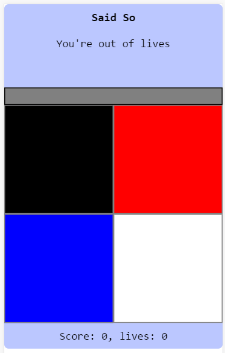

The fourteenth game from my one-game-a-day project.

Play [Said So](./play/) or scroll down to learn more.

This one's good! And I believe it's an original idea. If it was copied from somewhere, it was subconscious. The idea for this game just popped into my head, fully-formed: a voice saying "When I say _red_, click _red_" and continuing from there.

This hit the sweet spot of being a complete game concept that I'd never done before but which was easy to code. The result is one of my best one-day games.

My tweet from the release:

> I pretend to make #onegameaday using JavaScript! Here are my latest two
> 
> Lucky Win: [https://mgatland.com/games/lucky-win/play/](../lucky-win/play/) 
> Said So: [https://mgatland.com/games/said-so/play/](./play/)

See the full [twitter thread](https://twitter.com/mgatland/status/872313516769906688).
