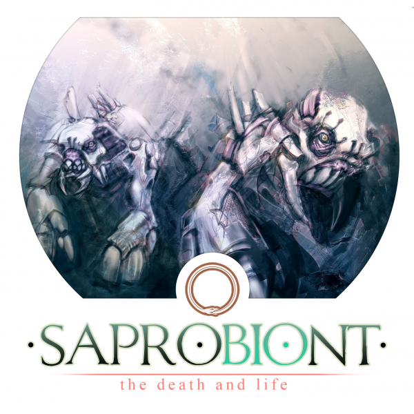
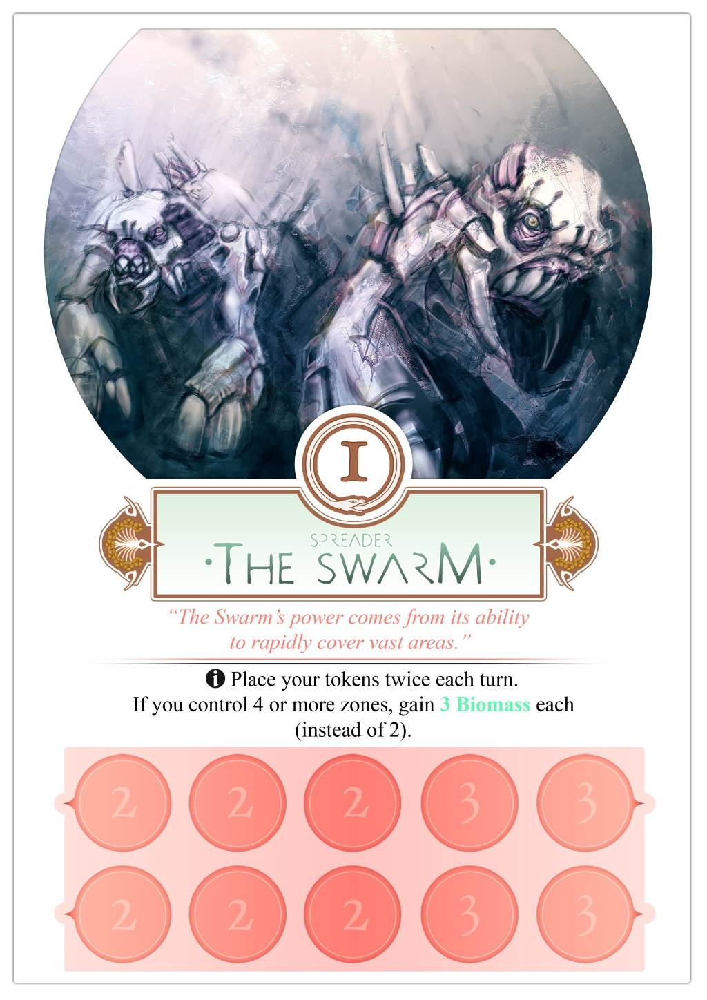
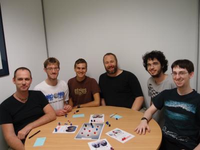

Saprobiont is a board game that was created in 48 hours for the Global Game Jame 2012.

The lead designer was Carl de Visser, an experienced board game designer. He was joined by me and two other programmers, who helped with the design and testing, and two artists.

Most people make computer games for the Global Game Jam. There's usually a little bit of design up front, and then a whole lot of coding as the game is built. if there's any time left at the end, there might be a few tweaks to the game design to make it better.

With Saprobiont, we started playtesting within the first hour of the event. And we played the game over and over again for 20 hours non-stop.

Having never worked on a board game before, it was an amazing experience for me. Without bugs, renderers, physics engines or AI, all you do is game design. We played, argued, adjusted the rules and played again. We played the game about 100 times. I estimate that we tried 50 variations before settling on the final rules.

You can [download Saprobiont](http://archive.globalgamejam.org/sites/default/files/uploads/2012/18885/Saprobiont.pdf) to print and play, or visit our [Global Game Jam page](http://globalgamejam.org/2012/saprobiont) for more information. We also have a page on [Board Game Geek.](https://boardgamegeek.com/boardgame/119219/saprobiont)

Our artists produced some fantastic artwork for the rulebook.

Here's the full team.

<iframe width="560" height="315" src="https://www.youtube.com/embed/N3vof28eYDI" frameborder="0" allowfullscreen></iframe>

This page was added on 2012-02-29.
