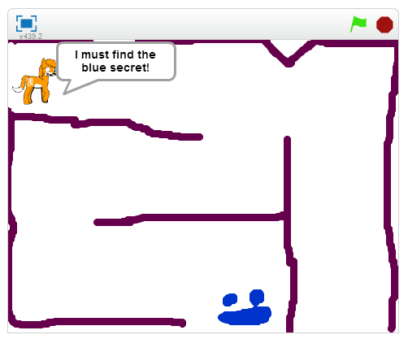

Scratch is a beginner programming tool made by MIT. I've taught over 40 Scratch workshops for Auckland Libraries, OMG Tech, and FutureInTech.

Here are some games made by our students:

* [Auckland Libraries Scratch games](https://scratch.mit.edu/studios/1362714/projects/)
* [OMG Tech! Scratch games](https://scratch.mit.edu/studios/1290284/projects/)

Here are some of my own games:

* [the secret of the blue secret](https://scratch.mit.edu/projects/23926823/)
* [time travel cat](https://scratch.mit.edu/projects/56537738/)
* [Car Judge](https://scratch.mit.edu/projects/58028814/)
