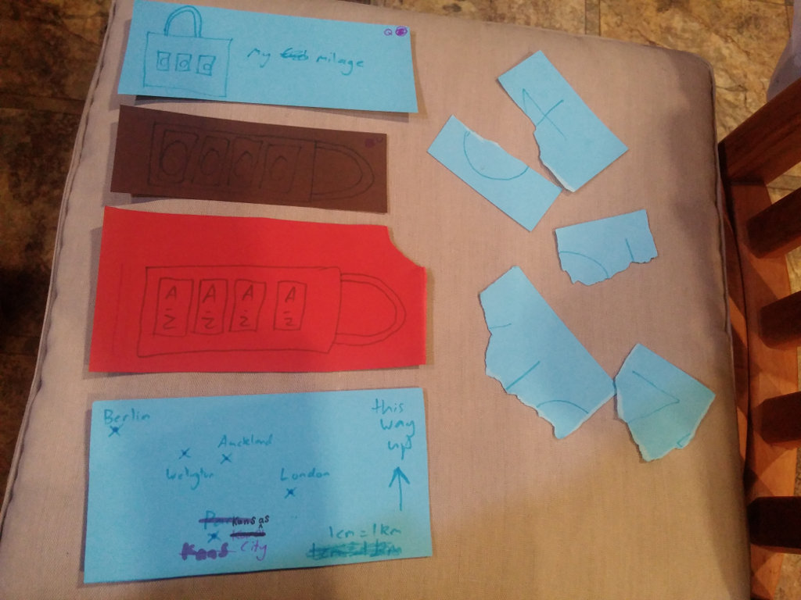
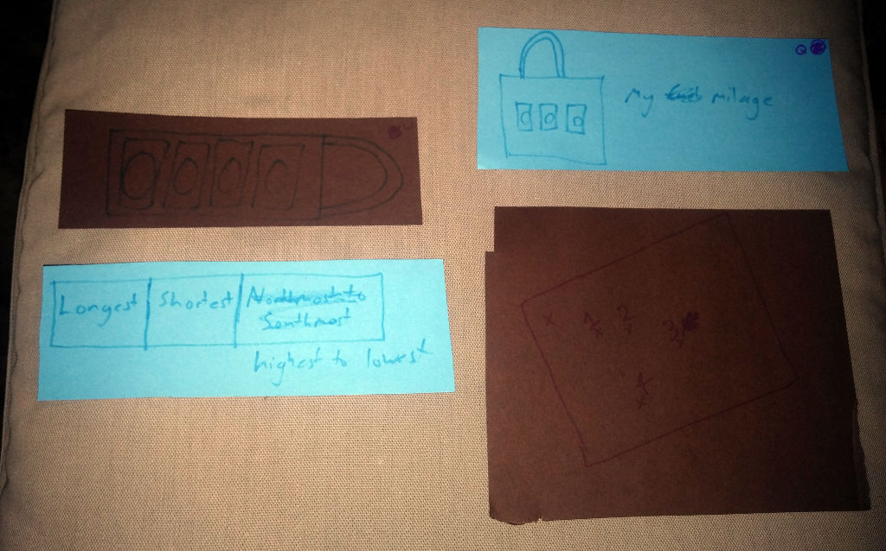

The twenty-second game from my one-game-a-day project.

I made a quick Escape-the-Room game at [Scribble](https://www.facebook.com/scribbleakl/) (a weekly Creative Conversations Club). It's not digital so you can't play it, unless you come and borrow the physical copy from me. But here is what it looked like:

Not pictured: A 30cm ruler.

The padlocks are not clues. They are meant to represent real padlocks and when players know the right combination, they unlock additional clues which are shown here below the padlock:

Opening the red padlock ends the game. (Or, in the revised edition, it leads to the final superpuzzle! Also not pictured.)

I originally planned on making 100 games in 100 days, but this ended up being the last one. For a while I thought I would still catch up and hit the target, but I eventually realized it was not going to happen. I officially ended the project about two weeks later, with this tweet:

> I tried to make 100 games in 100 days. You'll never guess what happened next? [https://matthewgatland.com/100days/](https://matthewgatland.com/100days/)

See the full [twitter thread](https://twitter.com/mgatland/status/885100230693105664).
