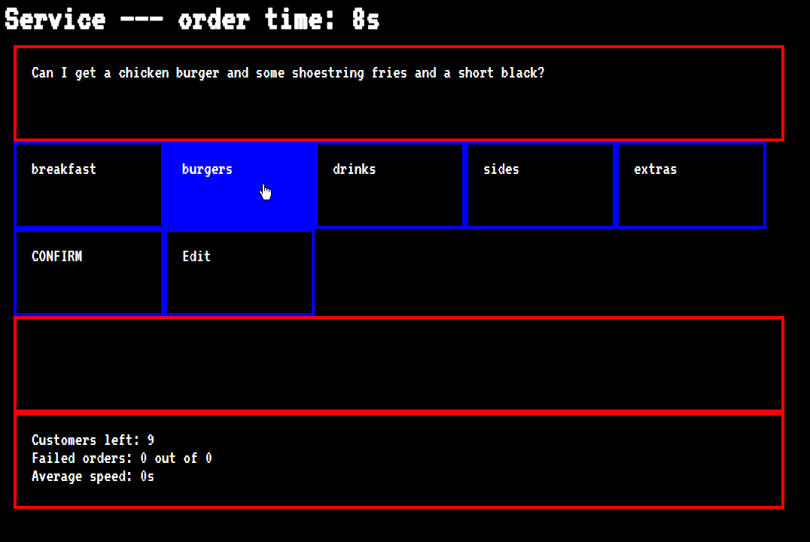

The third game from my one-game-a-day project.

Play [Service](./play/) or scroll down to learn more.

This was inspired by the real user interfaces used by service workers. I haven't worked this kind of job myself, but I remember seeing glimpses of the screens at my local New World Supermarket and being facinated by the retro UI.

I think this is quite good for a one-day game. It's fun to memorize where different things are in the menus and come up with your own process for reading and entering large orders efficiently.

I made sure that a few menu items were a bit confusing or hard to categorize. There's one item that feels like it's technically in the wrong place, but for reasons that make sense once you know what you're doing. I was trying to create the feeling of learning on the job.

My tweets from the release:

> My third one-day game: [https://mgatland.com/games/service/play](./play)
> 
> They continue to be very rough around the edges. #100DaysNZ

> (I've patched it to make the boss go easier on you… it is your first day and with no training)

See the [discussion on twitter](https://twitter.com/mgatland/status/867347090308907008)
