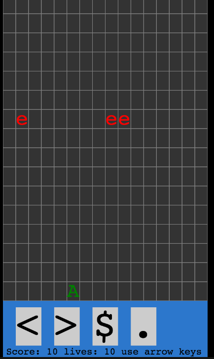
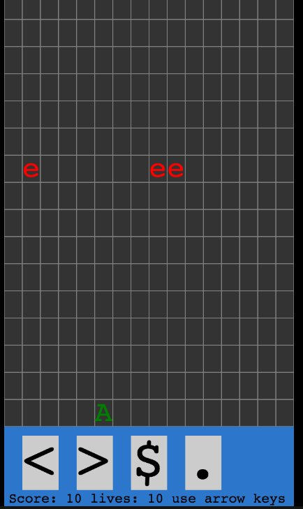

The twelfth game from my one-game-a-day project.

Play [shotdown](./play/) or scroll down to learn more.

An attempt to remake one of my first-ever games. When I started learning to code I made several of these text-only games with ASCII graphics, using QBasic. The original version of this was inspired by Space Invaders but I put my own twist on it.

As usual, the one-day remake is not as good as the original, but the original game is lost so this remake is all we have to go off for now. The original had a special, powerful attack that destroyed the entire row above you in an instant but cost some kind of special ammo or perhaps consumed your points.

The original also used nicer colors. I remember it having some kind of rainbow effect going on.

Anyway, this remake has two kinds of enemies who will try to avoid your shots and get to the bottom of the screen. It captures some of the feeling of the lost original game, where you create waves of shots to try to heard the enemies to the side of the screen where you can eliminate them.

If you've been reading these entries in order you'll note that I am no longer trying to make my one-day games non-violent! I am still trying to make every one in a wildly different genre though.

My tweet from the release:

> Here is my #onegameaday for yesterday. This is a partial remake of one of my first QBasic games~ #100DaysNZ
> 
> [https://mgatland.com/games/shotdown/play/](./play/)
> 
> 

See the full [twitter thread](https://twitter.com/mgatland/status/870949800149004290).
