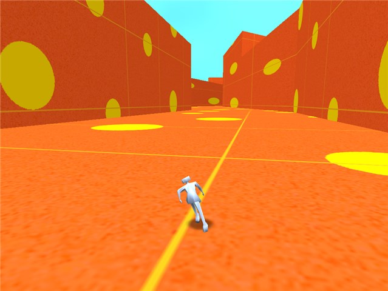
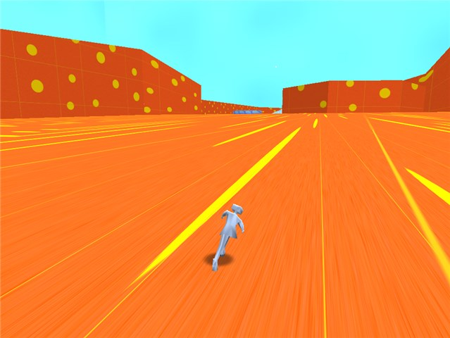
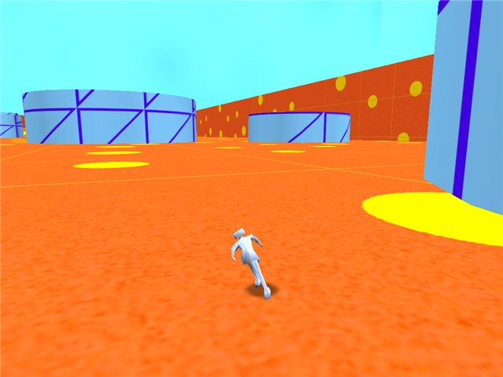
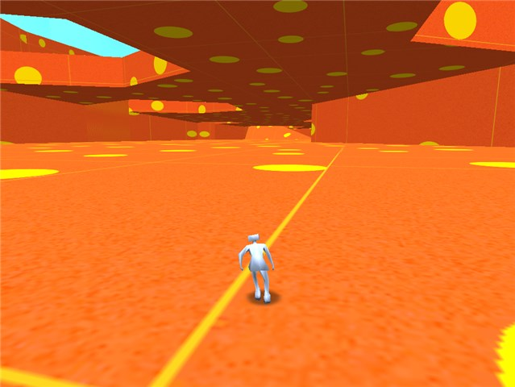

Skate is a one-week prototype skating game, inspired by Zineth and Jet Set Radio.

It's all about going fast and feeling good.

<a href="skate-windows.zip" onClick="_gaq.push(['_trackEvent','Download','Game',this.href]);; ">Skate 0.1 for Windows</a> (10 MB)

<a href="skate-mac.zip" onClick="_gaq.push(['_trackEvent','Download','Game',this.href]);; ">Skate 0.1 for OS X</a> (10 MB)

Most of my games revolve around exploring, making progress, following a story, or earning points. For Skate, I wanted to focus on the moment-to-moment feeling of the game, instead of those longer-term goals.

 
 
 
 