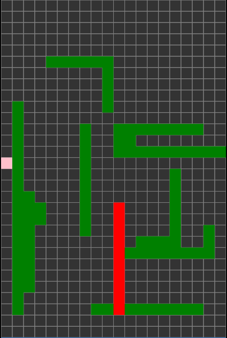
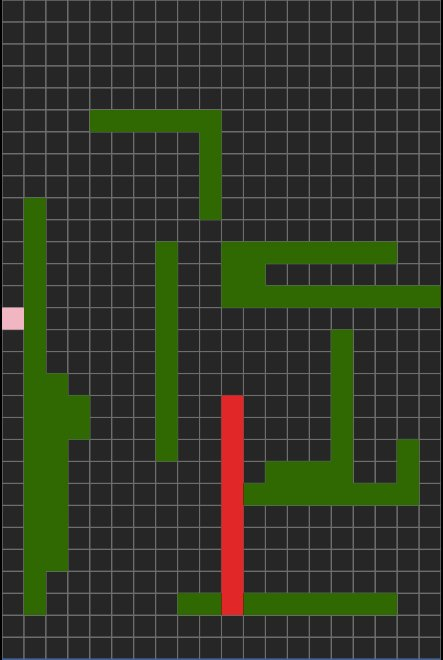

The eleventh game from my one-game-a-day project.

Play [snakeshed](./play/) or scroll down to learn more.

A Snake variation. Enough said?

At this point in the one-game-a-day project it was getting harder to come up with ideas. I wanted every one-day-game to feel different, and I wanted to take the opportunity to do types of games I hadn't done before. So, for example, I didn't want to make a new 2D platformer every day.

This game had the shortest development time of all of the game-a-day games at around 45 minutes.

My tweet from the release:

> I'm a day behind but here is yesterday's #onegameaday for #100DaysNZ – [https://mgatland.com/games/snakeshed/play/](./play/)
> 
> it's a snake
>
> 

See the full [twitter thread](https://twitter.com/mgatland/status/870588569001185281).
