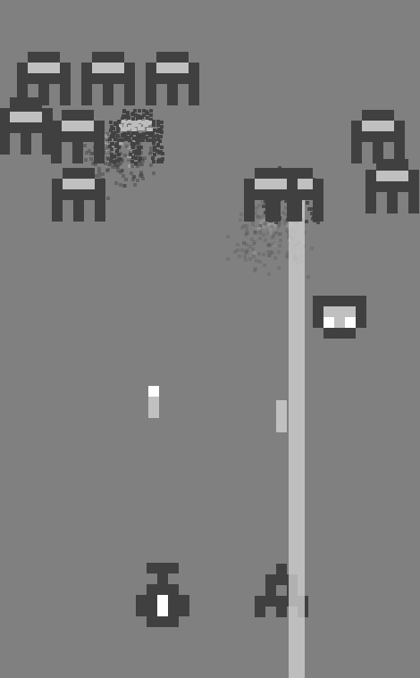
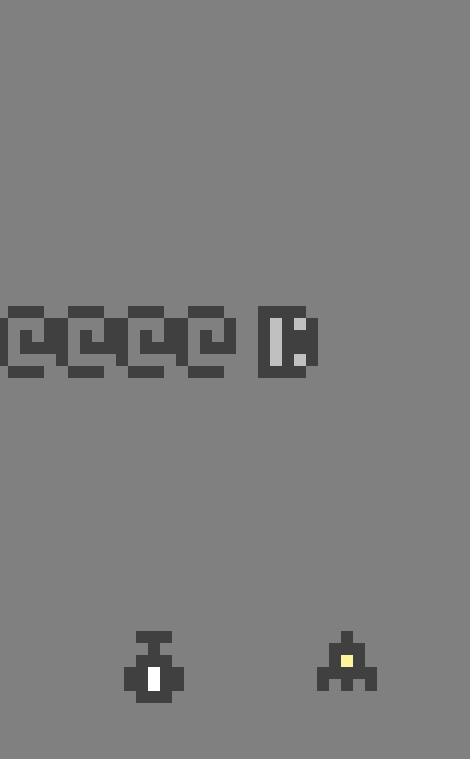
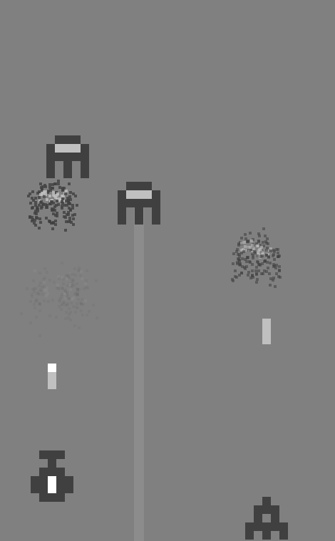

A two-player shooter in shades of grey.

Download <a href="https://dl.dropboxusercontent.com/u/97676465/Space%20Octopus%20Mono.zip" onclick="_gaq.push(['_trackEvent','Download','Game',this.href]);; ">Space Octopus Mono</a> (Windows only)

If it doesn't work, you may need to install these files from Microsoft:

1. [Microsoft .NET Framework 4 Client Profile](http://www.microsoft.com/en-us/download/details.aspx?id=24872)
2. [Microsoft XNA Framework Redistributable 4.0](http://www.microsoft.com/en-us/download/details.aspx?id=20914)

If it still doesn't work, you can email me at <hi@mgatland.com>.