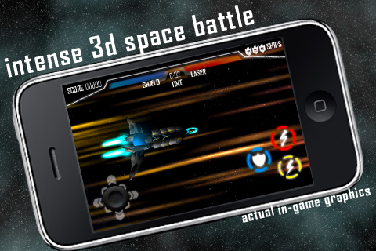

Space Hawk is an iPhone game by <b>StarKiwi Studios</b>. I was the programmer, working with designer\producer Ryan Thatcher and the artists from <a href="http://www.mediadesignschool.com/blog/studio-profile-madminute">madMinute.</a>

The game is no longer available, but you can still watch the trailer!

<iframe src="https://player.vimeo.com/video/15758900" width="500" height="281" frameborder="0" webkitallowfullscreen mozallowfullscreen allowfullscreen></iframe>

Space Hawk was displayed in the Dowse Art Museum and around New Zealand in the [Arcade: Homegrown Video Games](http://dowse.org.nz/exhibitions/detail/arcade-homegrown-video-games) exhibition.

More info:

[Interview with leo about Space Hawk](http://www.stuff.co.nz/dominion-post/technology/4295938/Your-turn-Space-Hawk-for-iPhone)

Screenshots:

