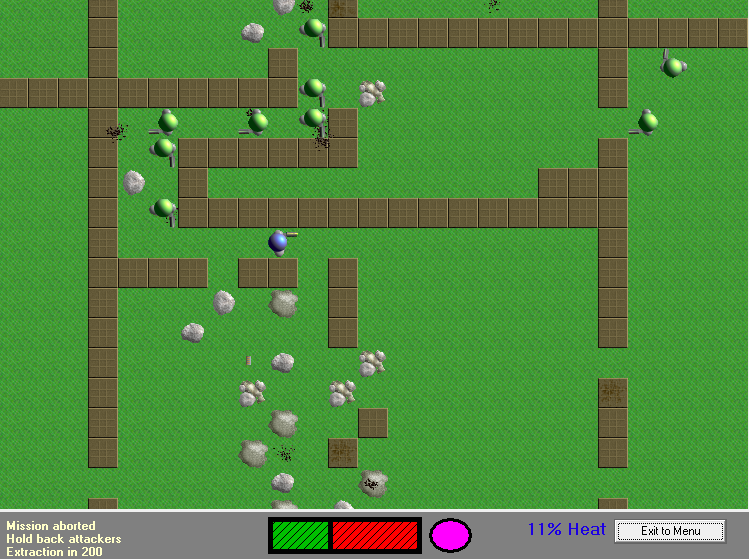
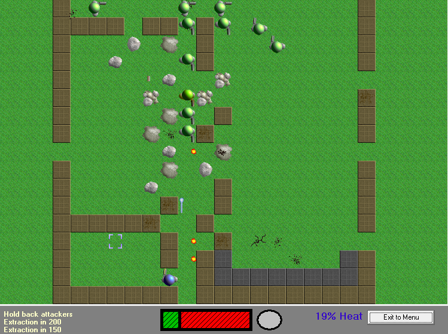
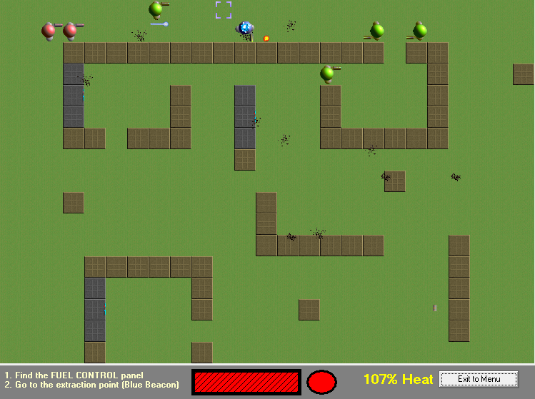

TakeDown is a 2D game of action and strategy, taking elements from traditional 
arcade style games and modern, story driven strategy games. You take on the 
role of a 'Peacekeeper', the most elite soldier the world has ever seen. You 
are the first and final fighting force to protect the fabric of society from 
those that seek to destroy it.

Play <a href="play/">TakeDown</a>

 
 
That's how I described it in 2002, anyway. I was 16 years old and thought TakeDown was my magnum opus.

It's a top town, tile-based shooter with something new in every mission. There's no proper ending, but if you manage to find your friend you should consider yourself a winner. (The missions after that are incomplete.)

You can play TakeDown in your web browser using the link above. That version was written in 2013, but it's designed to look and feel just like the much older original game.

You can also download the old, Windows only version of TakeDown:

<a href="takedown-install-1.2.exe" onClick="_gaq.push(['_trackEvent','Download','Game',this.href]);; ">TakeDown 1.2</a> (2 MB, Windows only)

The Windows version has more features and spelling mistakes.

[Read the old readme file](old-readme.html)

[Read more](/journal/2013-08-05-rewriting-takedown/) about making TakeDown.

