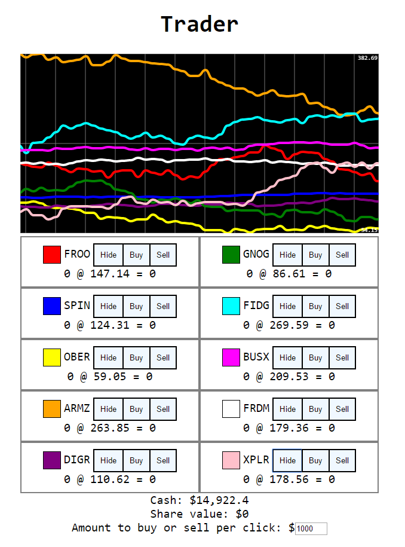

The eighteenth game from my one-game-a-day project.

Play [Trader](./play/) or scroll down to learn more.

So… I think this one is fun! No-one reacted when I released it so I wonder if it doesn't come across as clearly as some of the earlier games. Maybe my audience was just burnt out by this point in the game-a-day project.

You buy and sell shares and try to make a profit.

The market is a little unbalanced; there's a trick you can use to guarantee profits and kind of break the game. If I had another day of development I would fix that. But apart from that, this is a compelling concept. Buy low, sell high, and jump from company to company as you chase profit.

There's a lot of room to expand this.

This game had 1 hour and 56 minutes of development time.

My tweet from the release:

> it's a game based on my favourite hobby [https://mgatland.com/games/trader/play/](./play/) #onegameaday #almost
> 

See the full [twitter thread](https://twitter.com/mgatland/status/876302892163932160).
