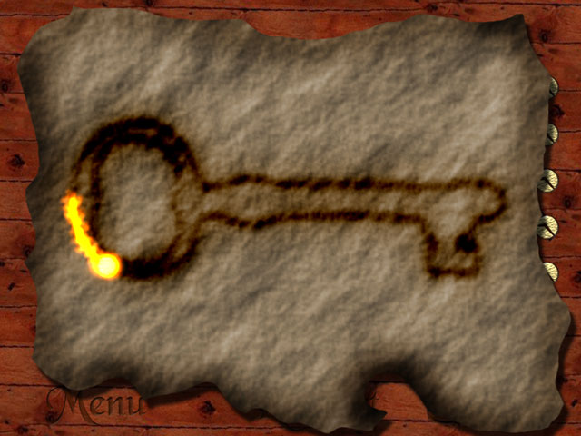
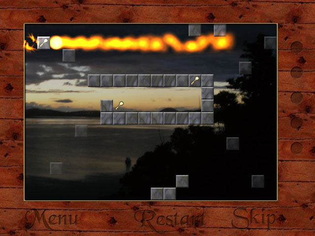

This is a puzzle game where you move a fiery glowing ball around a maze, with photos of New Zealand in the background.

<a href="trail-bay-full.exe" onclick="_gaq.push(['_trackEvent','Download','Game',this.href]);; ">Trail Bay (Full version)</a> (12 MB, Windows only)

Trail Bay was my first attempt at a commercial game. In 2006, I had just finished the first year of my engineering degree, and my first summer job at a power company. After 10 weeks of full time work in an office, I decided that I would rather be making games.

I thought I'd finish Trail Bay in a few months. It actually took a whole year, even after cutting lots of features.

I made a free trial version and put the full version on sale for $20.

A few hundred people downloaded the trail. I didn't sell any copies of the full version.

Here are some links for historical interest:

<a href="trail-bay-demo.exe" onclick="_gaq.push(['_trackEvent','Download','Game',this.href]);; ">Trail Bay (Demo)</a> (5 MB, Windows only)

<a href="/archive/looseleafgames/">Loose Leaf Games</a>, the website I made to sell Trail Bay.

