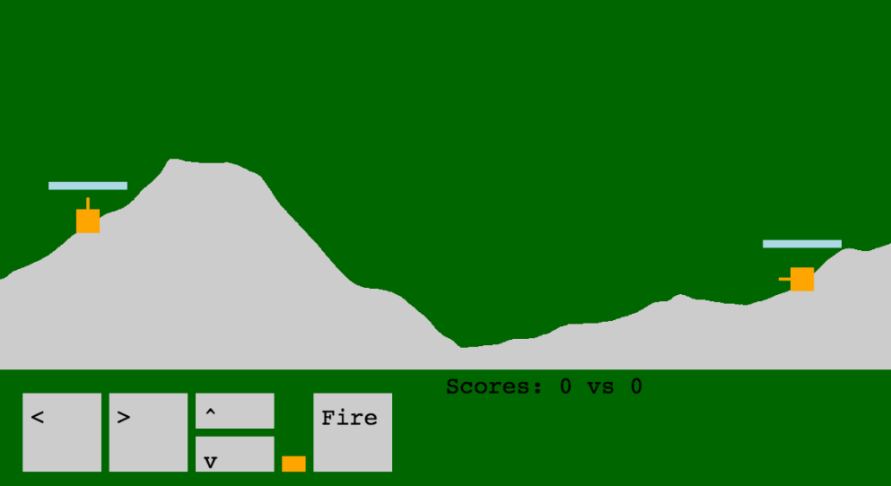

The ninth game from my one-game-a-day project.

Play [Vampire Tanks](./play/) or scroll down to learn more.

Inspired by a long line of 2D turn-based artillary games.

The artillary game that I spend the most time with growing up was [Scorcched Earth](https://en.wikipedia.org/wiki/Scorched_Earth_(video_game)) by Wendell Hicken. It was very cool. You earned money in the battles which you spent on a wide variety of consumable upgrades - basically the model that Counterstrike eventually popularized.

Another notable artillary game was Gorillas, also known as GORILLA.BAS. This game's source code was included with QBasic and was one of the first programs I saw the code for.

Anyway, my game, Vampire Tanks…… it's not very good. The nicest thing I can say is that it works! It's a working artillary game. It has a working AI opponent. It has working destructable terrain. I had never made this type of game before and now I have, in one day, and that's cool for me. I'm happy that I kept exploring new genres for this project. But I don't feel like there is anything special here for the player.

My tweets from the release:

> hi my name is matthew and i'm doing a tweet every day for #100DaysNZ
> 
> also here is a game: [https://mgatland.com/games/vampire-tanks/play/](./play/)

> this has been the worst one yet. It took ages and doesn't have much to show for it. OTOH I've wanted to make one of these for a long time!

In reply to some nice comments:
> ah, thanks! I'm trying to stop apologising\complaining each time, and just let them be what they are

See the full [twitter thread](https://twitter.com/mgatland/status/869071222675349505).

Separately, I also wrote:
> Main lesson from #onegameaday so far: work on the core feature first. It's easy to waste 30m on something minor, save it for later (never)

I don't remember what feature I was talking about though!