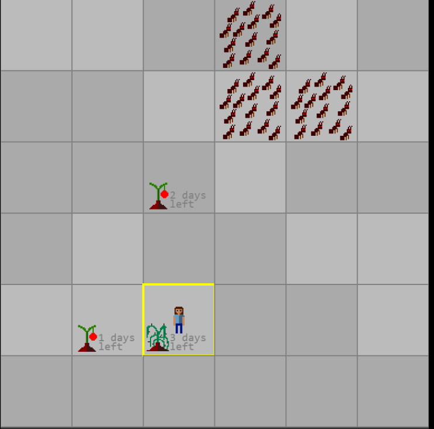

The fifth game from my one-game-a-day project.

Play [Winter in Space](./play/) or scroll down to learn more.

Arguably the best game in my whole game-a-day project! This is a proper original game, not a clone or remake of anything I'd seen before. I think the small 6x6 grid was inspired by Michael Brough's design sensibilities and a talk he gave about using a small space to focus a design, but the game itself is not at all in his style.

Like some of my earlier game-a-day games, this can be quite fun if you play it over and over until you understand the rules. There isn't replayability once you know how to win, but in this game there is quite an interesting learning journey before you get to the point where you can win every single time.

I asked for and recieved a lot of advice over the past few days about how to make a good turn-based game. The approach I chose here is basically to let player choose between different resources, when it's hard to predict how many of each resource will be needed. 

I'm very proud of this game. The difference in design quality between this and Glitchrace, which I made just two days earlier, is huge.

My tweets from the release:

> anyway here is my late game for yesterday for #100DaysNZ [https://mgatland.com/games/winter-in-space/play/](./play/)

See the [discussion on twitter](https://twitter.com/mgatland/status/868341420158930944). Kor posted an imgur thread of screenshots showing his progress through the game which was a lot of fun to see.
