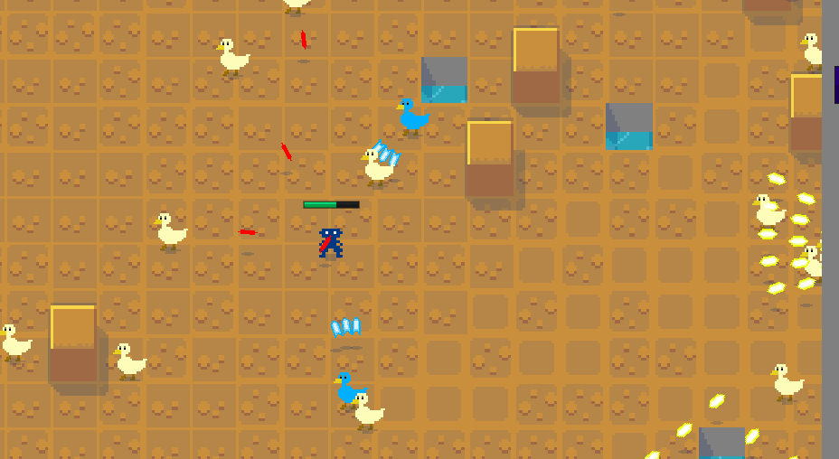

An unfinished bullet-hell MMO.

It's basically a clone of the popular game Realm of the Mad God. I spent a lot of time working on a complicated lag-compensation system that means you can still shoot and dodge precisely even on a laggy connection.

I probably should have spent less time on that, and focused on making it fun instead. There isn't much to do in the game – you can go up levels and find a few different enemy types but that's about it. I think it could be really interesting with a bit more content.

I hope you enjoy the game!

_This is the first game released with the support of my [anti-patrons](/anti-patreon)._

_Update 2023-03-27: This game was originally titled 'Wizard School Dropout' and later titled and exhibited as 'Witches Expelled'. It's now called 'Wizard School Survivors'._

Play <a href="https://witches3.azurewebsites.net">Wizard School Survivors</a>

